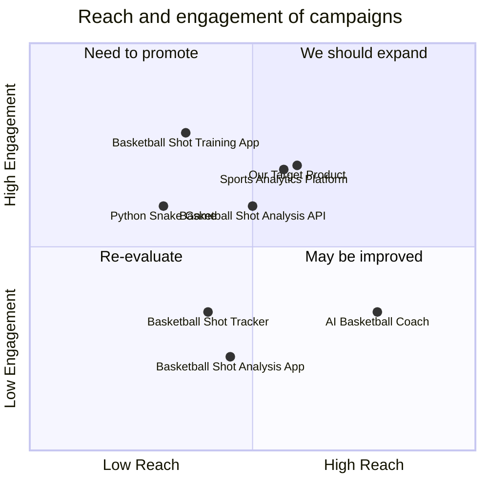

## Original Requirements:
Build an artificial intelligence application built on the concept of object detection. Analyze basketball shots by digging into the data collected from object detection. We can get the result by simply uploading files to the web App or submitting a POST request to the API.

## Product Goals:
- Create an AI application that uses object detection to analyze basketball shots.
- Provide an easy-to-use interface for uploading files or submitting POST requests to get the analysis results.
- Deliver accurate and insightful data analysis for basketball shots.

## User Stories:
- As a basketball coach, I want to upload videos of basketball shots to the application and receive detailed analysis of the shots, including accuracy, angle, and trajectory.
- As a basketball player, I want to submit a POST request with the necessary shot data to the API and receive real-time feedback on the quality of my shots.
- As a basketball analyst, I want to use the application to analyze large datasets of basketball shots and identify patterns and trends in shooting performance.
- As a basketball fan, I want to use the application to analyze professional basketball games and gain insights into the shooting performance of players and teams.
- As a developer, I want to integrate the application's API into my own basketball-related applications to provide shot analysis functionality to my users.

## Competitive Analysis:
- Python Snake Game: A popular game that allows users to control a snake and collect food while avoiding obstacles.
- Basketball Shot Analysis App: An existing application that provides basic shot analysis for basketball players.
- Sports Analytics Platform: A comprehensive platform that offers advanced analytics for various sports, including basketball.
- AI Basketball Coach: An AI-powered application that provides personalized coaching and analysis for basketball players.
- Basketball Shot Tracker: A device that tracks and records basketball shots, providing data on accuracy and shot trajectory.
- Basketball Shot Training App: An application that offers training exercises and drills to improve basketball shooting skills.
- Basketball Shot Analysis API: An API that provides shot analysis functionality for developers to integrate into their applications.

## Competitive Quadrant Chart:


## Requirement Analysis:
The product should be an AI application that uses object detection to analyze basketball shots. It should provide accurate and insightful analysis of shot accuracy, angle, and trajectory. The application should have an easy-to-use interface for users to upload videos or submit shot data through a POST request. The analysis results should be delivered in real-time and should be easily understandable by basketball coaches, players, analysts, and fans. The application should also provide the option to analyze large datasets of basketball shots and identify patterns and trends in shooting performance.

## Requirement Pool:
```python
[
    ("Provide accurate shot analysis including accuracy, angle, and trajectory", "P0"),
    ("Support uploading videos for analysis", "P0"),
    ("Support submitting shot data through a POST request", "P0"),
    ("Deliver real-time analysis results", "P1"),
    ("Provide easy-to-understand analysis for basketball coaches, players, analysts, and fans", "P1")
]
```

## UI Design draft:
The UI design should include the following elements:
- A file upload button for users to upload videos for analysis.
- A form for users to submit shot data through a POST request.
- A real-time analysis display that shows the analysis results.
- Visualizations and charts to represent shot accuracy, angle, and trajectory.
- Navigation menus and buttons for easy user interaction.
- A clean and modern design with a basketball theme, including relevant colors and graphics.
- Responsive layout to ensure compatibility with different screen sizes and devices.

## Anything UNCLEAR:
There are no unclear points.