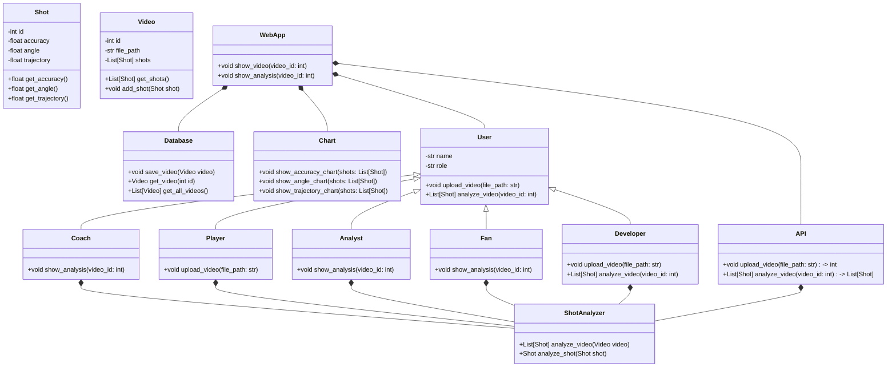
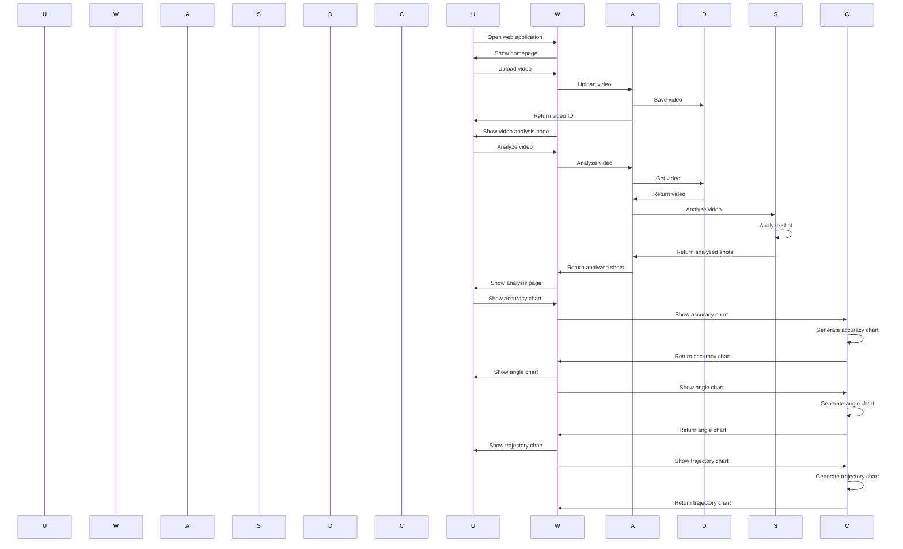

## Implementation approach:
To build the AI application for basketball shot analysis, we will use the following open-source tools and frameworks:

1. OpenCV: OpenCV is a popular computer vision library that provides various functions for image and video processing. We will use OpenCV for object detection and tracking in basketball shots.

2. TensorFlow: TensorFlow is an open-source machine learning framework that provides tools for building and training deep learning models. We will use TensorFlow's object detection API to train a model for basketball shot detection.

3. Flask: Flask is a lightweight web framework for building web applications. We will use Flask to create the web application and API endpoints for uploading videos and submitting shot data.

4. React: React is a JavaScript library for building user interfaces. We will use React to create a modern and responsive user interface for the web application.

5. Chart.js: Chart.js is a JavaScript library for creating interactive charts and graphs. We will use Chart.js to visualize shot accuracy, angle, and trajectory.

6. PostgreSQL: PostgreSQL is a powerful open-source relational database management system. We will use PostgreSQL to store and analyze large datasets of basketball shots.

By leveraging these open-source tools and frameworks, we can build a robust and scalable AI application for basketball shot analysis.

## Python package name:
```python
"basketball_shot_analysis"
```

## File list:
```python
[
    "main.py",
    "app.py",
    "models.py",
    "utils.py",
    "templates/index.html",
    "static/js/app.js",
    "static/css/style.css"
]
```

## Data structures and interface definitions:


## Program call flow:


## Anything UNCLEAR:
The requirements are clear and there are no unclear points.